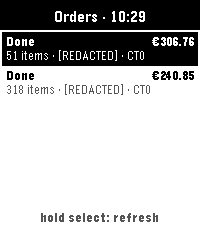
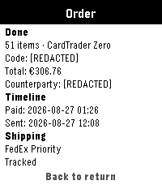
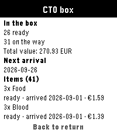
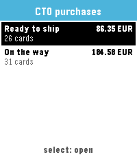

# PebTrader Zero

[](https://github.com/dottorblaster/pebtrader-zero/actions/workflows/build.yml)

A PebbleOS (Alloy) watch app to view the state of your
[CardTrader Zero](https://www.cardtrader.com/) orders, right on your wrist.

| Orders | Order detail | CardTrader Zero box | CT0 purchases |
| --- | --- | --- | --- |
|  |  |  |  |

The watch UI is JavaScript with the [Alloy](https://developer.repebble.com/guides/alloy/)
framework (Moddable XS). CardTrader API calls run on the phone in PebbleKit JS,
so your API token never leaves the phone.

> **Status:** feature-complete for v0.1 — order list, order detail, CT0 box,
> CT0 purchases, settings and an offline cache. See the
> [issues](https://github.com/dottorblaster/pebtrader-zero/issues) for what's next.

## Target platforms

Alloy supports the modern Pebble hardware only:

- **emery** — Pebble Time 2
- **gabbro** — Pebble Round 2

## Getting started

### 1. Install the toolchain

Install [uv](https://docs.astral.sh/uv/getting-started/installation/), then
install the Pebble CLI and SDK:

```sh
uv tool install pebble-tool
pebble sdk install latest
```

Make sure `~/.local/bin` is on your `PATH` (the `uv tool install` output tells
you how to add it).

### 2. Install emulator dependencies

The emulator needs SDL2 and a few graphics libraries. On openSUSE:

```sh
sudo zypper install libSDL2-2_0-0 glib2-tools libpixman-1-0 libz1
```

On Ubuntu:

```sh
sudo apt install libsdl2-2.0-0 libglib2.0-0 libpixman-1-0 zlib1g libsndio7.0
```

### 3. Build and run

```sh
pebble build                      # build for all targetPlatforms
pebble install --emulator emery   # install and launch on the emery emulator
pebble install --emulator gabbro  # ...or the gabbro emulator
```

To install on a physical watch (Developer Connection enabled in the Pebble app):

```sh
pebble login
pebble install --cloudpebble
```

Tagged builds are attached to
[Releases](https://github.com/dottorblaster/pebtrader-zero/releases) as a
downloadable `.pbw`.

### 4. Configure it

Add your CardTrader API token from the app's settings in the Pebble mobile app.
See [docs/configuration.md](docs/configuration.md) for where to find the token
and what each setting does.

## Using the app

The default screen is your order list.

| Button | Action |
| --- | --- |
| Up / Down | Scroll / move the selection |
| Select | Open the selected order |
| Back | Go back (press and hold to exit) |
| Hold Select | Refresh |
| Hold Down | Open the CardTrader Zero box |
| Hold Up | Open CT0 purchases, split into ready to ship / on the way |

The last snapshot is cached on the watch, so the list is shown instantly on
launch and still appears (marked **cached** in the header) when the phone is
away or CardTrader is unreachable.

## Project layout

```
src/c/mdbl.c                   C glue around the Moddable runtime (heap sizing)
src/embeddedjs/                JavaScript that runs on the watch (UI + logic)
src/pkjs/                      PebbleKit JS: CardTrader API calls (phone side)
src/common/                    Code shared by both JavaScript environments
test/                          Node unit tests + sanitized fixtures
tools/mock-cardtrader/         Local mock API for end-to-end testing
```

Alloy apps have two JavaScript environments: `embeddedjs` runs on the watch,
`pkjs` runs on the connected phone. A full module map is in
[docs/architecture.md](docs/architecture.md).

## Documentation

- [Configuration](docs/configuration.md) — the API token and every setting
- [Architecture](docs/architecture.md) — components, data flow, endpoints
- [Protocol](docs/protocol.md) — the watch ↔ phone wire contract
- [Security & privacy](SECURITY.md) — threat model and privacy note
- [Releasing](docs/releasing.md) — versioning, tags, GitHub Releases and the app store
- [Troubleshooting](docs/troubleshooting.md) — common problems

## Testing

```sh
npm test    # unit tests, no watch or network needed
```

`tools/mock-cardtrader` runs a local server that serves the sanitized fixtures,
so the app can be exercised end to end (list, detail, box and every error
state) without the real API. See
[its README](tools/mock-cardtrader/README.md).

## External references

- Alloy framework: <https://developer.repebble.com/guides/alloy/>
- Pebble developer docs: <https://developer.repebble.com/>
- PebbleOS firmware docs: <https://pebbleos-core.readthedocs.io/>
- CardTrader API: <https://www.cardtrader.com/en/docs/api>
